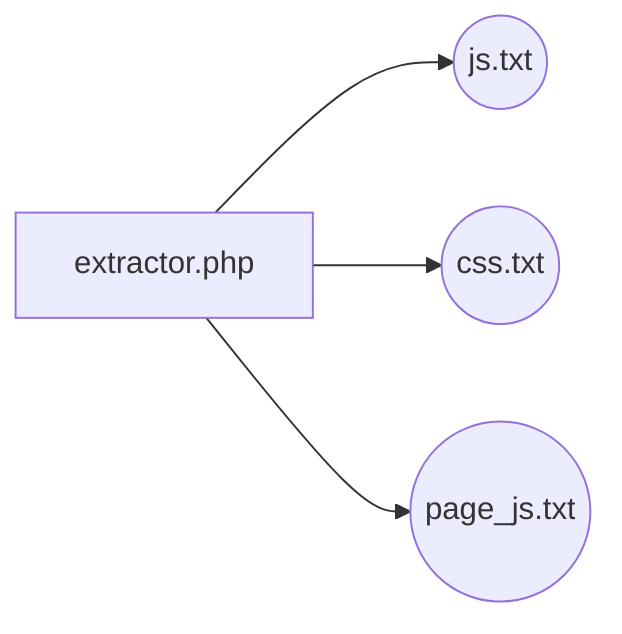

# Extractor CSS JS Filename!

Extract css and js filename on your theme HTML for example to include in your yii2 application.

 - Open extractor.php and put your path on $startDirectory.
 - Launch extractor.php

# Files

 - **js.txt** : list of all js files to include in your AppAsset of yii2 in $js variable.
 - **css.txt** :  list of all css files to include in your AppAsset of yii2 in $js variable.
 - **page_js.txt** :  list of all html pages of your theme with script that are used it.

